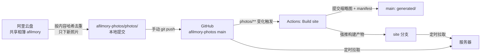

# 照片更新流程

**一句话：本地跑 `pull-album.sh` → 手动 `git push` 照片仓库 → Actions 自动构建 → 服务器定时拉取上线。** afilmory 本仓库全程不用动、不用部署。



## 日常操作

```bash
# 1. 拉相簿新照片到照片仓库并本地提交（默认相簿 afilmory、仓库 ~/code/self/afilmory-photos）
bash scripts/pull-album.sh

# 2. 推送（Actions 可能已往 main 提交过 generated/，先 rebase）
cd ~/code/self/afilmory-photos
git pull --rebase
git push
```

推送后到照片仓库的 Actions 页看 `Build site` 是否成功，之后等服务器定时拉取上线。

## 各环节做了什么

| 环节 | 位置 | 要点 |
| --- | --- | --- |
| 下载 | `scripts/pull-album.py` | 调相簿接口列出文件，按 `content_hash` 跳过 `album-index.json` 里已有的；直接下到 `photos/`，`.livp` 拆成同名 HEIC/JPG + MOV |
| 入库 | `scripts/pull-album.sh` | 先用 `aliyunpan album ls` 刷新登录凭证再调上面的脚本；检查单文件 >95MB、仓库总量 >4000MB；只 commit 不 push |
| 构建 | 照片仓库 `.github/workflows/build.yml` | 拉取 afilmory 最新代码，用上次的 `generated/` 做增量缓存，`PHOTOS_DIR` 指向 `photos/` 跑 `pnpm --filter web build` |
| 产物 | 同上 | 缩略图 + `photos-manifest.json` 提交回 main 的 `generated/`；网页强推到只有一个提交的 `site` 分支 |
| 上线 | 服务器 | 定时拉取 `site` 分支和 `photos/` 并对外提供；服务器配置见私有照片仓库的 README |

## 关键设计

- **原图不进构建产物**：`builder.config.ts` 的 `baseUrl: '/photos'` 指向服务器上的原图目录，`site` 分支只有网页和缩略图，体积小、可每次覆盖。
- **构建前还原文件 mtime**：builder 按 mtime 判断照片是否变化，checkout 会重置 mtime，所以先用每个文件的最后提交时间还原，保证只处理新照片。
- **Actions 不持有服务器凭证**：只用 `GITHUB_TOKEN` 写仓库，服务器主动拉，单向依赖。
- **`pull-album.sh` 只提交不推送**：留给人确认后再 push，避免误传大文件。
- **按内容去重，不按文件名**：照片仓库根目录的 `album-index.json` 记录 `content_hash → 文件列表`，随仓库提交，换机器也能续传。同一张照片加了多次只下一份；同名但内容不同（如 iPhone 编辑导出的 `FullSizeRender`）时，后加入的追加哈希前 8 位，如 `FullSizeRender_a744237b.JPG`。已入库的文件名不再变化，manifest 里的照片 ID 也就稳定。
- **先写临时文件再改名**：下载到 `photos/.<名字>.part`，大小校验通过才改成正式文件名，中断不会留下残缺或全零的原图。

## 常见情况

| 情况 | 处理 |
| --- | --- |
| 相簿里删了照片 | 脚本只增不删，手动从 `photos/` 删除，并从 `album-index.json` 去掉对应条目，一起提交 |
| 改了 afilmory 应用代码（前端、builder） | 在照片仓库 Actions 页手动触发 `Build site`（`workflow_dispatch`），afilmory 的 push 不会触发构建 |
| 下载中断或失败 | 直接重跑脚本，已完成的照片在索引里，只补没下完的 |
| 提示「无法确认 photos/ 里的 xxx 对应哪张照片」 | `photos/` 里有未入索引的同名文件，而相簿里这个名字对应多张照片：删掉这些文件后重跑 |
| 登录凭证过期 | `aliyunpan login` 重新登录 |
| push 被拒 `remote contains work` | Actions 刚提交过 `generated/`，`git pull --rebase` 后再推；两边改的目录不重叠，不会冲突 |
| push 报 HTTP 408 | 一次推送的数据太大，用 `git -c http.postBuffer=1048576000 -c http.version=HTTP/1.1 push` |
| 单文件超过 100MB | GitHub 拒收，脚本会报出文件名，移出仓库 |
